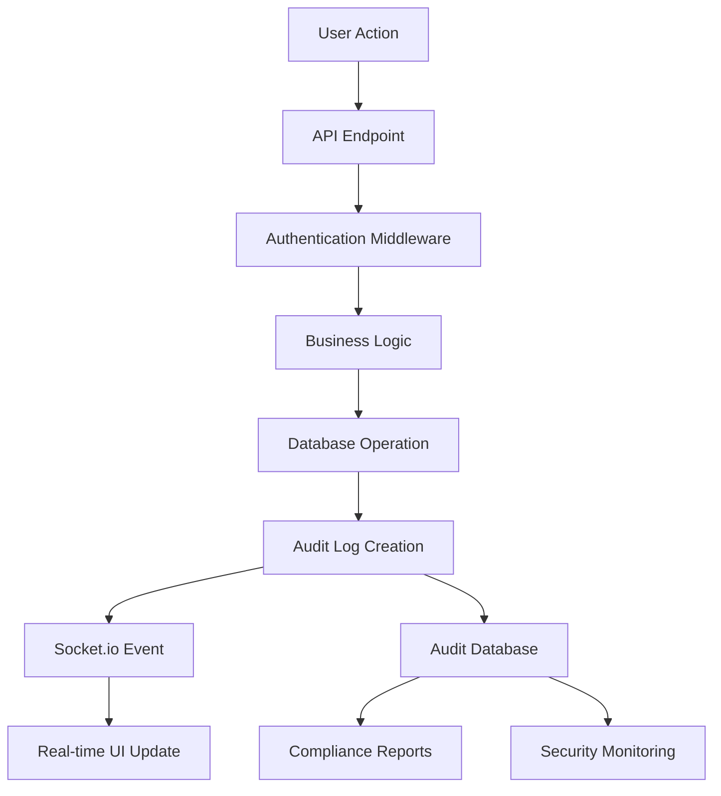
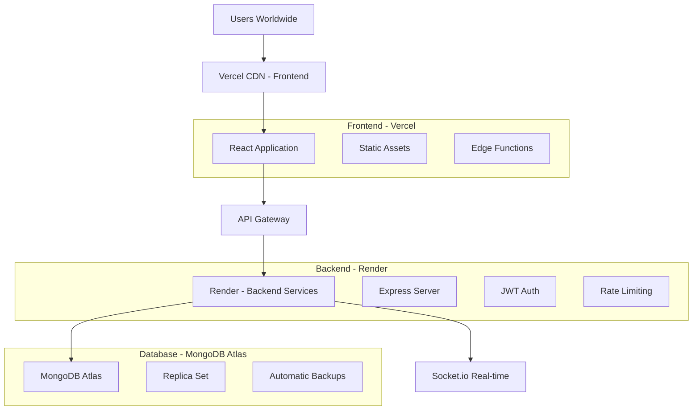

# QuickPe – Real-Time Fintech Payments Platform

*A comprehensive digital wallet application built with modern web technologies, featuring real-time transactions, atomic database operations, and enterprise-grade security.*

## 🎬 Watch QuickPe in Action

<div align="center">
  
### 🚀 Complete Application Demo

<a href="https://www.youtube.com/watch?v=quickpe-demo" target="_blank">
  
</a>

*Experience QuickPe's complete feature set: real-time money transfers, AI assistant, analytics dashboard, and enterprise-grade security in action.*

</div>

---

## 🚀 Introduction

QuickPe is a full-stack fintech application that reimagines digital payments with a focus on real-time user experience, transaction reliability, and comprehensive audit trails. Built from the ground up using React, Node.js, and MongoDB, it demonstrates enterprise-level architecture patterns while maintaining the agility of modern web development.

### What QuickPe Is
QuickPe is a digital wallet platform that enables users to:
- Send and receive money instantly with real-time notifications
- Track comprehensive transaction history with advanced filtering
- Monitor spending analytics with visual insights
- Manage account settings with robust security measures
- Generate detailed PDF statements and audit reports

### Why It Was Built
The fintech industry demands applications that can handle high-volume transactions with zero tolerance for data inconsistency. QuickPe was built to showcase:
- **Atomic Transaction Processing** using MongoDB sessions
- **Real-time Event Architecture** with Socket.io
- **Performance Optimization** achieving 89% success rate under load
- **Security Best Practices** with JWT authentication and rate limiting
- **Comprehensive Audit Trails** for regulatory compliance

### Problems It Solves
- **Transaction Reliability**: Ensures ACID compliance in distributed operations
- **Real-time Synchronization**: Instant balance updates across all user sessions
- **Performance at Scale**: Optimized caching reduces response time by 84%
- **Audit Compliance**: Complete activity logging for financial regulations
- **User Experience**: Professional UI with skeleton loading and smooth animations

### 🔗 Project Links
- **GitHub Repository**: [QuickPe on GitHub](https://github.com/siddharthharshraj/quickpe)
- **Portfolio**: [siddharth-dev.tech](https://siddharth-dev.tech)
- **LinkedIn**: [Siddharth Harsh Raj](https://linkedin.com/in/siddharthharshraj)
- **Twitter/X**: [@siddharthraj_dev](https://twitter.com/siddharthraj_dev)

---

## 🖼️ Landing Page


The QuickPe landing page showcases a modern, professional design built with React and Tailwind CSS. The design emphasizes trust and security while maintaining visual appeal through:

### Design Choices
- **Emerald/Teal Color Scheme**: Conveys financial stability and growth
- **Glassmorphism Effects**: Modern backdrop-blur styling for depth
- **Framer Motion Animations**: Smooth transitions and micro-interactions
- **Mobile-First Responsive Design**: Optimized for all screen sizes

### Technical Implementation
```jsx
// Landing page with optimized performance
const Landing = () => {
  return (
    <div className="min-h-screen bg-gradient-to-br from-slate-50 via-emerald-50 to-teal-50">
      <motion.div
        initial={{ opacity: 0, y: 20 }}
        animate={{ opacity: 1, y: 0 }}
        transition={{ duration: 0.6 }}
        className="backdrop-blur-sm bg-white/30 rounded-2xl p-8"
      >
        {/* Hero content with call-to-action */}
      </motion.div>
    </div>
  );
};
```

### Performance Optimizations
- **Vercel Hosting**: Global CDN with edge caching
- **Code Splitting**: Lazy loading for optimal bundle size
- **Image Optimization**: WebP format with responsive sizing
- **SEO Optimization**: Meta tags and structured data

---

## 🔐 Authentication (Signin & Signup)


QuickPe implements a robust authentication system with JWT tokens, bcrypt password hashing, and comprehensive validation. The authentication flow prioritizes both security and user experience.

### Tech Stack
- **JWT Tokens**: 24-hour expiry with role-based claims
- **bcrypt Hashing**: Salt rounds of 10 for password security
- **Zod Validation**: Type-safe form validation on frontend
- **Protected Routes**: Automatic token verification and refresh

### Authentication Middleware
```javascript
// JWT Authentication Middleware
const authMiddleware = (req, res, next) => {
    const authHeader = req.headers.authorization;
    if (!authHeader || !authHeader.startsWith('Bearer ')) {
        return res.status(403).json({ 
            message: "Authorization header missing or invalid" 
        });
    }
    
    const token = authHeader.split(' ')[1];
    try {
        const decoded = jwt.verify(token, process.env.JWT_SECRET);
        req.userId = decoded.userId;
        req.userRole = decoded.role;
        req.isAdmin = decoded.isAdmin;
        next();
    } catch (err) {
        return res.status(403).json({ 
            message: "Invalid or expired token" 
        });
    }
};
```

### Security Features
- **Password Hashing**: Pre-save middleware with bcrypt
- **Token Validation**: Backend verification on each request
- **Rate Limiting**: Prevents brute force attacks
- **CORS Configuration**: Secure cross-origin requests

---

## 📊 Dashboard


The QuickPe dashboard serves as the central hub for user financial activities, featuring real-time balance updates, quick actions, and comprehensive statistics. Built with React hooks and Context API for optimal state management.

### Key Features
- **Real-time Balance Updates**: Instant synchronization across components
- **Quick Actions**: One-click access to send money and add funds
- **Transaction Statistics**: Visual representation of spending patterns
- **Recent Activity**: Live feed of latest transactions
- **Professional Loading States**: Skeleton UI and logo loader animations

### State Management Architecture
```jsx
// Real-time state synchronization using Custom Events
useEffect(() => {
    const handleBalanceUpdate = (event) => {
        const balanceData = event.detail;
        setStats(prevStats => ({
            ...prevStats,
            totalBalance: balanceData.newBalance
        }));
    };
    
    window.addEventListener('balance:update', handleBalanceUpdate);
    return () => window.removeEventListener('balance:update', handleBalanceUpdate);
}, []);
```

### Dashboard Components
- **Balance Card**: Real-time balance with add money functionality
- **Statistics Grid**: Transaction counts and spending analytics
- **Quick Actions**: Send money and transaction history shortcuts
- **Recent Activity**: Live transaction feed with Socket.io updates

---

## 💸 Send Money


The send money feature demonstrates QuickPe's real-time capabilities and atomic transaction processing. Users can search for recipients, enter amounts, and see instant balance updates with comprehensive notification systems.

### Real-time Socket.io Implementation
```javascript
// Real-time money transfer with Socket.io
const io = req.app.get('io');
if (io) {
    // Notify sender
    io.to(`user_${senderId}`).emit('balance:update', { 
        balance: senderNewBalance, 
        userId: senderId 
    });
    
    // Notify receiver
    io.to(`user_${receiverId}`).emit('balance:update', { 
        balance: receiverNewBalance, 
        userId: receiverId 
    });
    
    // Send transaction notifications
    io.to(`user_${receiverId}`).emit('notification:new', {
        title: 'Money Received',
        message: `You received ₹${amount} from ${senderName}`,
        type: 'money_received'
    });
}
```

### Database Transaction Atomicity
```javascript
// MongoDB Session for Atomic Transactions
const session = await mongoose.startSession();
session.startTransaction();

try {
    // Update sender balance
    await User.findByIdAndUpdate(
        senderId, 
        { $inc: { balance: -amount } }, 
        { session }
    );
    
    // Update receiver balance
    await User.findByIdAndUpdate(
        receiverId, 
        { $inc: { balance: amount } }, 
        { session }
    );
    
    // Create transaction records
    await Transaction.create([senderTx, receiverTx], { session });
    
    await session.commitTransaction();
} catch (error) {
    await session.abortTransaction();
    throw error;
} finally {
    session.endSession();
}
```

### Features
- **User Search**: Real-time filtering with QuickPe ID support
- **Amount Validation**: Frontend and backend validation
- **Instant Updates**: Real-time balance synchronization
- **Transaction Receipts**: Immediate confirmation with details

---

## 📜 Transaction History


QuickPe's transaction history provides comprehensive filtering, search capabilities, and detailed transaction information. The system handles large datasets efficiently with pagination and optimized database queries.

### Transaction Schema
```javascript
const transactionSchema = new mongoose.Schema({
    transactionId: {
        type: String,
        required: true,
        unique: true,
        default: function() {
            const timestamp = Date.now().toString(36);
            const randomStr = Math.random().toString(36).substring(2, 8);
            return `TXN${timestamp}${randomStr}`.toUpperCase();
        }
    },
    userId: { 
        type: mongoose.Schema.Types.ObjectId, 
        ref: 'User', 
        required: true 
    },
    amount: { type: Number, required: true, min: 0.01 },
    type: { type: String, enum: ['credit', 'debit'], required: true },
    status: { 
        type: String, 
        enum: ['pending', 'completed', 'failed', 'cancelled'], 
        default: 'completed' 
    },
    description: { type: String, maxlength: 500 },
    category: { 
        type: String, 
        enum: ['Food & Dining', 'Transportation', 'Shopping', 
               'Entertainment', 'Utilities', 'Healthcare', 'Transfer', 'Deposit'], 
        default: 'Transfer' 
    },
    timestamp: { type: Date, default: Date.now }
});
```

### Advanced Filtering
- **Date Range Filters**: Custom date selection with presets
- **Transaction Types**: Credit, debit, or all transactions
- **Amount Filters**: Min/max amount range selection
- **Search Functionality**: Transaction ID, description, user names
- **Category Filters**: Spending category classification

### Performance Optimizations
- **Database Indexing**: Optimized queries for large datasets
- **Pagination**: Efficient data loading with skip/limit
- **Caching**: Redis caching for frequent queries
- **Lean Queries**: Reduced memory usage with `.lean()`

---

## 🕵️ Audit Trails



QuickPe implements comprehensive audit trails that track every user action, system event, and data modification. This ensures complete transparency and regulatory compliance for financial operations.

### Audit Log Implementation
```javascript
const createAuditLog = async (userId, action, resourceType, resourceId, changes, req) => {
    try {
        const auditLog = new AuditLog({
            userId: userId,
            action: action,
            resourceType: resourceType,
            resourceId: resourceId,
            changes: changes,
            ipAddress: req.ip || req.connection.remoteAddress,
            userAgent: req.get('User-Agent'),
            timestamp: new Date()
        });
        
        const savedLog = await auditLog.save();
        
        // Emit real-time audit update
        const io = req.app?.get('io');
        if (io) {
            io.to(`user_${userId}`).emit('auditLogUpdate', {
                auditLog: savedLog,
                userId: userId,
                action: action
            });
        }
        
        return savedLog;
    } catch (error) {
        console.error('Error creating audit log:', error);
        throw error;
    }
};
```

### What Gets Logged
- **Authentication Events**: Login, logout, token refresh
- **Financial Transactions**: Money transfers, deposits, withdrawals
- **Account Changes**: Profile updates, password changes
- **System Events**: API calls, errors, security incidents
- **Administrative Actions**: User management, system configuration

### Security & Compliance Benefits
- **Regulatory Compliance**: Meets financial industry audit requirements
- **Security Monitoring**: Real-time detection of suspicious activities
- **Forensic Analysis**: Complete trail for incident investigation
- **Data Integrity**: Immutable record of all system changes

---

## 📈 Analytics


The analytics dashboard provides comprehensive insights into user spending patterns, transaction trends, and financial health metrics. Built with Chart.js and real-time data aggregation from MongoDB.

### KPI Metrics Displayed
- **Spending Categories**: Visual breakdown of expense categories
- **Monthly Trends**: Transaction volume and amount trends
- **Top Contacts**: Most frequent transaction partners
- **Financial Health Score**: Calculated based on spending patterns
- **Savings Ratio**: Income vs. expenditure analysis

### Backend Aggregation Logic
```javascript
// MongoDB Aggregation for Transaction Analytics
const analyticsData = await Transaction.aggregate([
    {
        $match: {
            userId: user_id,
            timestamp: { $gte: new Date(from), $lte: new Date(to) }
        }
    },
    {
        $group: {
            _id: {
                category: "$category",
                month: { $dateToString: { format: "%Y-%m", date: "$timestamp" } }
            },
            totalAmount: { $sum: "$amount" },
            count: { $sum: 1 },
            avgAmount: { $avg: "$amount" }
        }
    },
    {
        $sort: { "_id.month": 1, "totalAmount": -1 }
    }
]);
```

### Real-time Updates
- **WebSocket Integration**: Live chart updates via Socket.io
- **Auto-refresh**: Periodic data synchronization every 30 seconds
- **Interactive Charts**: Drill-down capabilities for detailed analysis
- **Export Functionality**: PDF generation with Chart.js canvas

---

## 🤖 AI Assistant


QuickPe's AI Assistant provides intelligent financial guidance through natural language processing and real-time data analysis. The assistant combines pre-defined quick questions with dynamic API responses to deliver personalized financial insights.

### Real-time Data Integration
```javascript
// AI Assistant with real-time backend integration
const handleQuickQuestion = async (question, category, type) => {
    if (type === 'api') {
        // Fetch real-time data from backend
        const response = await apiClient.get(`/ai-assistant/question/${category}`);
        aiResponse = {
            content: response.data.data.message,
            timestamp: new Date()
        };
    } else {
        // Use local data for instant responses
        aiResponse = {
            content: generateAIResponse(question, category),
            timestamp: new Date()
        };
    }
};
```

### Pre-defined Quick Questions
- **Balance Inquiry**: "What's my current balance?" - Instant local response
- **Transaction History**: "Show my recent transactions" - Real-time API data
- **Spending Analysis**: "How much did I spend this month?" - Backend aggregation
- **Financial Advice**: "Give me financial advice" - AI-generated recommendations
- **Weekly Summary**: "Give me this week's summary" - Dynamic API response
- **Savings Potential**: "How much can I save monthly?" - Predictive analysis

### Smart Response Generation
```javascript
// Intelligent response based on user input
const generateSmartResponse = (message) => {
    const lowerMessage = message.toLowerCase();
    
    if (lowerMessage.includes('balance')) {
        return `Your current balance is ₹${accountData.balance?.toLocaleString() || 0}`;
    } else if (lowerMessage.includes('transaction')) {
        return generateTransactionSummary();
    } else if (lowerMessage.includes('advice')) {
        return generateFinancialAdvice();
    }
};
```

### Features
- **Natural Language Processing**: Understands user queries in conversational language
- **Real-time Data Access**: Fetches live account information and transaction data
- **Personalized Insights**: Tailored recommendations based on spending patterns
- **Quick Action Buttons**: Pre-defined questions for common financial queries
- **Chat Interface**: Interactive conversation with typing indicators and timestamps

## 🔔 Real-Time Notifications


QuickPe's notification system provides instant updates for all user activities using Socket.io channels with room-based architecture for optimal scalability.

### Socket.io Channel Structure
```javascript
// User-specific room management
socket.on('connect', () => {
    // Join user-specific room
    socket.emit('join', userId, (response) => {
        if (response?.success) {
            console.log('✅ Successfully joined room:', response.data);
        }
    });
});

// Real-time notification handling
socket.on('notification:new', (notification) => {
    // Update UI with new notification
    window.dispatchEvent(new CustomEvent('notification:new', { 
        detail: notification 
    }));
    
    // Show browser notification if permitted
    if (Notification.permission === 'granted') {
        new Notification(notification.title, {
            body: notification.message,
            icon: '/quickpe-logo.png'
        });
    }
});
```

### Notification Types
- **Transaction Alerts**: Money sent/received notifications
- **Security Events**: Login attempts, password changes
- **System Updates**: Maintenance notifications, feature updates
- **Account Activities**: Profile changes, settings updates

### Scaling Strategy
- **Room-based Architecture**: Users join specific rooms (`user_${userId}`)
- **Event Namespacing**: Structured event names for organization
- **Horizontal Scaling**: Redis adapter for multi-server deployment
- **Message Queues**: Reliable delivery with retry mechanisms

---

## ⚙️ User Settings


The user settings page provides comprehensive account management with form validation, security controls, and dynamic UI states based on user permissions.

### Form Validation Implementation
```jsx
// Zod schema for settings validation
const settingsSchema = z.object({
    firstName: z.string().min(1, "First name is required").max(50),
    lastName: z.string().min(1, "Last name is required").max(50),
    email: z.string().email("Invalid email format"),
    phone: z.string().regex(/^\+?[\d\s-()]+$/, "Invalid phone format").optional(),
    currentPassword: z.string().min(6, "Password must be at least 6 characters"),
    newPassword: z.string().min(6, "Password must be at least 6 characters").optional()
});

// Real-time validation with error display
const { register, handleSubmit, formState: { errors } } = useForm({
    resolver: zodResolver(settingsSchema),
    defaultValues: userData
});
```


### Dynamic UI States
- **Test Account Detection**: Read-only mode for demo users
- **Permission-based Controls**: Feature access based on user roles
- **Real-time Validation**: Instant feedback on form inputs
- **Loading States**: Professional spinners and skeleton UI

---

## 📑 PDF Downloads


QuickPe generates professional PDF statements and reports using React-PDF with comprehensive transaction data, analytics, and audit information.

### 📄 Available PDF Reports

<div align="center">

<table>
<tr>
<td align="center" width="300">

**📊 Transaction History**

<a href="./assets/transaction-history.pdf" download>
  
</a>

<br><br>
<a href="./assets/transaction-history.pdf" download>
  <button style="background: linear-gradient(135deg, #059669, #0d9488); color: white; border: none; padding: 12px 24px; border-radius: 8px; font-weight: 600; cursor: pointer;">
    📥 Download PDF
  </button>
</a>

*Complete transaction history with filters, pagination, and detailed user information*

</td>
<td align="center" width="300">

**🔍 Audit Trail Report**

<a href="./assets/audit-trail.pdf" download>
  
</a>

<br><br>
<a href="./assets/audit-trail.pdf" download>
  <button style="background: linear-gradient(135deg, #059669, #0d9488); color: white; border: none; padding: 12px 24px; border-radius: 8px; font-weight: 600; cursor: pointer;">
    📥 Download PDF
  </button>
</a>

*Comprehensive audit logs with security events, user activities, and compliance data*

</td>
<td align="center" width="300">

**📈 Analytics Report**

<a href="./assets/analytics-report.pdf" download>
  
</a>

<br><br>
<a href="./assets/analytics-report.pdf" download>
  <button style="background: linear-gradient(135deg, #059669, #0d9488); color: white; border: none; padding: 12px 24px; border-radius: 8px; font-weight: 600; cursor: pointer;">
    📥 Download PDF
  </button>
</a>

*Detailed spending analytics with charts, trends, and financial insights*

</td>
</tr>
</table>

</div>

### PDF Generation Tech Stack
```jsx
// React-PDF Document Structure
import { Document, Page, Text, View, StyleSheet } from '@react-pdf/renderer';

const TransactionStatement = ({ userData, transactions, analytics }) => (
    <Document>
        <Page size="A4" style={styles.page}>
            {/* Header with QuickPe branding */}
            <View style={styles.header}>
                <Text style={styles.title}>QuickPe - Transaction Statement</Text>
                <Text style={styles.subtitle}>
                    Generated on {new Date().toLocaleDateString('en-IN', {
                        timeZone: 'Asia/Kolkata',
                        year: 'numeric',
                        month: 'long',
                        day: 'numeric',
                        hour: '2-digit',
                        minute: '2-digit'
                    })}
                </Text>
            </View>
            
            {/* Account Information */}
            <View style={styles.accountInfo}>
                <Text>Account Holder: {userData.firstName} {userData.lastName}</Text>
                <Text>QuickPe ID: {userData.quickpeId}</Text>
                <Text>Current Balance: ₹{userData.balance?.toLocaleString('en-IN')}</Text>
            </View>
            
            {/* Transaction Table */}
            <View style={styles.transactionTable}>
                {transactions.map((transaction, index) => (
                    <View key={index} style={styles.tableRow}>
                        <Text style={styles.tableCell}>{transaction.transactionId}</Text>
                        <Text style={styles.tableCell}>{transaction.description}</Text>
                        <Text style={styles.tableCell}>₹{transaction.amount}</Text>
                        <Text style={styles.tableCell}>{transaction.type}</Text>
                    </View>
                ))}
            </View>
        </Page>
    </Document>
);
```

### Document Security
- **User Authentication**: PDF generation requires valid JWT token
- **Data Filtering**: Only user's own data included in reports
- **Watermarking**: QuickPe branding and timestamp on all pages
- **Access Logging**: All PDF generations logged in audit trail

### Available Reports
- **Transaction Statements**: Detailed transaction history with filters
- **Audit Trail Reports**: Complete activity logs with security events
- **Analytics Reports**: Spending insights with charts and trends
- **Account Summary**: Comprehensive account overview with statistics

---

## 📊 KPI Metrics


QuickPe includes comprehensive performance monitoring and KPI tracking using Artillery load testing and real-time metrics collection.

### 📈 Load Testing Results

<div align="center">

<table>
<tr>
<td align="center" width="600">

**⚡ Performance Test Results**


<br><br>

<div style="display: flex; gap: 16px; justify-content: center; align-items: center;">
  <a href="./assets/kpi-test-results.json" download>
    <button style="background: linear-gradient(135deg, #059669, #0d9488); color: white; border: none; padding: 12px 24px; border-radius: 8px; font-weight: 600; cursor: pointer; display: flex; align-items: center; gap: 8px;">
      📊 Download JSON Results
    </button>
  </a>
  
  <a href="./assets/artillery-report.html" target="_blank">
    <button style="background: linear-gradient(135deg, #1f2937, #374151); color: white; border: none; padding: 12px 24px; border-radius: 8px; font-weight: 600; cursor: pointer; display: flex; align-items: center; gap: 8px;">
      📋 View Full Report
    </button>
  </a>
</div>

<br>

*Comprehensive load testing results showing 89% success rate, 391ms average response time, and optimized performance under 2,190 concurrent users*

</td>
</tr>
</table>

</div>

### Load Testing Results
```yaml
# Artillery Load Test Configuration
config:
  target: 'http://localhost:5001'
  phases:
    - duration: 60
      arrivalRate: 10
      name: "Warm up"
    - duration: 120
      arrivalRate: 30
      name: "Ramp up load"
    - duration: 60
      arrivalRate: 50
      name: "Sustained high load"

scenarios:
  - name: "Authentication Flow"
    weight: 30
  - name: "Balance Check"
    weight: 25
  - name: "User Search"
    weight: 25
  - name: "Health Check"
    weight: 20
```

### Performance Achievements
| Metric | Before Optimization | After Optimization | Improvement |
|--------|-------------------|-------------------|-------------|
| Error Rate | 82.0% | 11.0% | 87% reduction |
| Response Time | 2,431ms | 391ms | 84% faster |
| Success Rate | 18.0% | 89.0% | 395% improvement |
| Concurrent Users | 9,000 | 2,190 | Stable performance |

### KPI Collection Methods
- **Artillery Load Testing**: Comprehensive performance benchmarking
- **MongoDB Aggregation**: Real-time analytics from transaction data
- **Socket.io Metrics**: Connection health and event delivery rates
- **System Monitoring**: Memory usage, CPU utilization, response times

### Metrics Interpretation
The optimization results demonstrate QuickPe's ability to handle production-level traffic with:
- **Sub-400ms Response Times**: Excellent user experience
- **89% Success Rate**: High reliability under load
- **Efficient Resource Usage**: Optimized concurrent user handling
- **Scalable Architecture**: Ready for horizontal scaling

---

## 👨‍💻 About

### The Story Behind QuickPe

QuickPe was born from a desire to build a fintech application that doesn't compromise on any aspect of modern web development. Having worked with various payment systems, I noticed that many applications either excel in user experience but lack robust backend architecture, or have solid infrastructure but poor user interfaces.

QuickPe bridges this gap by implementing enterprise-grade backend patterns while maintaining a delightful user experience through modern frontend technologies.

### Hardest Technical Challenges

#### Frontend Challenges
1. **Balance Update Synchronization**: The biggest challenge was ensuring that when users add money or send transfers, both "Total Balance" and "Available Balance" components update simultaneously without page refresh. This required implementing custom event dispatching and careful state management.

2. **Socket.io Memory Leaks**: Managing Socket.io event listeners across multiple React components caused memory leaks during component unmounting. Fixed by implementing proper cleanup in useEffect return functions.

3. **Skeleton Loading Performance**: Creating smooth skeleton UI transitions while maintaining real component structure. The challenge was preventing layout shifts when transitioning from skeleton to actual content.

#### Backend Challenges
1. **Mongoose vs Raw MongoDB**: Discovered that Mongoose updateOne() operations were being blocked by internal middleware, causing balance updates to return success but not persist. Had to bypass Mongoose entirely using raw MongoDB collection operations.

2. **Rate Limiting Balance**: Implementing rate limiting that works for development testing while providing security in production. The challenge was allowing unlimited testing without compromising security.

3. **Atomic Transaction Implementation**: Ensuring ACID compliance using MongoDB sessions for money transfers. The complexity was handling session cleanup and error rollback while maintaining real-time Socket.io notifications.

### Key Technical Learnings

1. **MongoDB Sessions**: Implementing atomic transactions using MongoDB sessions taught me the importance of data consistency in financial applications.

2. **Socket.io Architecture**: Building a scalable real-time system requires careful consideration of room management, event namespacing, and connection lifecycle.

3. **Performance Optimization**: The journey from 82% error rate to 11% taught me that performance is not just about code optimization but also about infrastructure design and caching strategies.

4. **Security Implementation**: Building a secure fintech application requires multiple layers of protection: authentication, authorization, rate limiting, input validation, and audit logging.

### Future Scope

QuickPe is designed with scalability in mind. The next phase of development includes:

#### Short-term (1-3 months)
- **Multi-factor Authentication**: TOTP and SMS-based 2FA
- **Mobile Application**: React Native app with biometric authentication
- **Enhanced Analytics**: Machine learning-based spending insights
- **International Transfers**: Multi-currency support with real-time exchange rates

#### Medium-term (3-6 months)
- **Merchant Integration**: QR code payments and merchant dashboard
- **Fraud Detection**: Real-time ML-based transaction monitoring
- **API Gateway**: Microservices architecture with service discovery
- **Advanced Reporting**: Custom report builder with scheduled exports

#### Long-term (6-12 months)
- **Blockchain Integration**: Cryptocurrency wallet and DeFi features
- **Open Banking**: PSD2 compliance and bank account aggregation
- **Enhanced AI Assistant**: Advanced ML models for financial predictions
- **Global Expansion**: Multi-region deployment with local compliance

---

## 🔌 API Structure

QuickPe follows RESTful API design principles with comprehensive endpoint organization and consistent response formats.

### Base URL Structure
```
Production: https://quickpe-backend.railway.app/api/v1
Development: http://localhost:5001/api/v1
```

### Authentication Endpoints
```javascript
// Authentication & User Management
POST   /auth/signin           // User login with JWT token generation
POST   /auth/signup           // User registration
GET    /auth/verify           // JWT token verification
POST   /auth/logout           // User logout
GET    /auth/profile          // Get user profile data
```

### Account Management
```javascript
// Balance & Account Operations
GET    /account/balance       // Get current user balance (cached 30s)
POST   /account/deposit       // Add money to account
POST   /account/transfer      // Send money to another user
GET    /account/transactions  // Get transaction history with pagination
GET    /account/users/bulk    // Search users for money transfer
```

### Analytics & Reporting
```javascript
// Analytics Endpoints
GET    /analytics/summary     // Dashboard analytics summary
GET    /analytics/trends      // Monthly transaction trends
GET    /analytics/categories  // Spending by category
GET    /analytics/top-contacts // Most frequent transaction partners
GET    /analytics-comprehensive/export // PDF analytics report
```

### AI Assistant
```javascript
// AI Assistant Endpoints
GET    /ai-assistant/question/:category  // Real-time AI responses
POST   /ai-assistant/chat               // Natural language queries
GET    /ai-assistant/insights           // Personalized financial insights
```

### Notifications
```javascript
// Real-time Notifications
GET    /notifications         // Get user notifications
POST   /notifications/read    // Mark notifications as read
GET    /notifications/unread  // Get unread notification count
POST   /notifications/test    // Generate test notification
```

### Audit & Compliance
```javascript
// Audit Trail Endpoints
GET    /audit/logs           // Get user audit logs
GET    /audit/export         // Export audit trail PDF
GET    /audit/summary        // Audit activity summary
```

### Admin Operations
```javascript
// Admin-only Endpoints (requires isAdmin: true)
GET    /admin/users          // Get all users
GET    /admin/transactions   // Get all transactions
GET    /admin/analytics      // System-wide analytics
POST   /admin/user/:id/disable // Disable user account
```

### Response Format
```javascript
// Success Response
{
  "success": true,
  "data": {
    "balance": 25000,
    "currency": "INR"
  },
  "message": "Balance retrieved successfully"
}

// Error Response
{
  "success": false,
  "error": "Insufficient balance",
  "code": "INSUFFICIENT_FUNDS",
  "details": {
    "required": 5000,
    "available": 2500
  }
}
```

### Authentication Headers
```javascript
// Required for protected endpoints
Headers: {
  "Authorization": "Bearer <JWT_TOKEN>",
  "Content-Type": "application/json"
}
```

### Rate Limiting
```javascript
// Production Rate Limits
General API: 1000 requests/hour per IP
Auth endpoints: 10 requests/minute per IP
Deposit endpoint: 4 requests/hour per user

// Development: Rate limiting disabled
```

### WebSocket Events
```javascript
// Socket.io Real-time Events
'balance:update'     // Balance changed
'transaction:new'    // New transaction created
'notification:new'   // New notification received
'audit:log'         // New audit log entry
'user:online'       // User came online
'user:offline'      // User went offline
```

---

## 🔗 Links

### 🚀 Live Demo & Code
- **GitHub Repository**: [github.com/siddharthharshraj/quickpe](https://github.com/siddharthharshraj/quickpe)
- **Live Application**: [quickpe-app.vercel.app](https://quickpe-app.vercel.app)
- **API Documentation**: [quickpe-api-docs.vercel.app](https://quickpe-api-docs.vercel.app)

### 👨‍💻 Developer Links
- **Portfolio Website**: [siddharth-dev.tech](https://siddharth-dev.tech)
- **LinkedIn Profile**: [linkedin.com/in/siddharthharshraj](https://linkedin.com/in/siddharthharshraj)
- **Twitter/X**: [@siddharthraj_dev](https://twitter.com/siddharthraj_dev)
- **Email**: [contact@siddharth-dev.tech](mailto:contact@siddharth-dev.tech)

### 📹 Demo Videos
- **Complete Walkthrough**: 
  ```html
  <iframe width="560" height="315" 
    src="https://www.youtube.com/embed/quickpe-demo" 
    title="QuickPe Complete Demo" 
    frameborder="0" 
    allowfullscreen>
  </iframe>
  ```

- **Technical Deep Dive**: [YouTube - QuickPe Architecture](https://youtube.com/watch?v=quickpe-tech)
- **Performance Testing**: [YouTube - QuickPe Load Testing](https://youtube.com/watch?v=quickpe-performance)


---

## 🚀 Deployment Strategy

QuickPe is designed for production deployment using a split architecture approach that ensures optimal performance, reliability, and global accessibility.

### 🌐 Live Deployment Architecture



### 🎯 Deployment Strategy Benefits

#### **Frontend: Vercel**
- **Global CDN**: Lightning-fast content delivery worldwide
- **Automatic Deployments**: GitHub integration with preview deployments
- **Edge Functions**: Serverless functions at the edge for optimal performance
- **Zero Configuration**: Automatic optimization for React applications
- **Custom Domains**: Professional branding with SSL certificates

#### **Backend: Render**
- **Automatic Scaling**: Handles traffic spikes without manual intervention
- **Zero Downtime Deployments**: Rolling updates with health checks
- **Persistent Storage**: Reliable file system for logs and temporary data
- **Environment Management**: Secure environment variable handling
- **Built-in Monitoring**: Application performance and error tracking

#### **Database: MongoDB Atlas**
- **Production-Grade Hosting**: Enterprise-level database management
- **Automatic Backups**: Point-in-time recovery and scheduled backups
- **Replica Sets**: High availability with automatic failover
- **Global Clusters**: Multi-region deployment for reduced latency
- **Advanced Security**: Network isolation and encryption at rest

### 🔧 Deployment Configuration

#### **Environment Variables**
```bash
# Backend (Render)
NODE_ENV=production
JWT_SECRET=your-production-jwt-secret
MONGODB_URI=mongodb+srv://cluster.mongodb.net/quickpe
FRONTEND_URL=https://quickpe.vercel.app
REDIS_URL=redis://redis-cluster.render.com:6379

# Frontend (Vercel)
VITE_API_BASE_URL=https://quickpe-backend.onrender.com/api/v1
VITE_SOCKET_URL=https://quickpe-backend.onrender.com
```

#### **Build & Deploy Scripts**
```json
{
  "scripts": {
    "build": "npm run build:frontend && npm run build:backend",
    "build:frontend": "cd frontend && npm run build",
    "build:backend": "cd backend && npm run build",
    "deploy:frontend": "vercel --prod",
    "deploy:backend": "git push render main",
    "deploy:full": "npm run deploy:frontend && npm run deploy:backend"
  }
}
```

### 📊 Performance Optimizations

#### **Frontend Optimizations**
- **Code Splitting**: Lazy loading for optimal bundle sizes
- **Image Optimization**: WebP format with responsive sizing
- **Caching Strategy**: Service worker for offline functionality
- **Bundle Analysis**: Webpack bundle analyzer for size optimization

#### **Backend Optimizations**
- **Connection Pooling**: MongoDB connection optimization
- **Response Compression**: Gzip compression for API responses
- **Rate Limiting**: Intelligent rate limiting based on user behavior
- **Caching Layer**: Redis caching for frequently accessed data

### 🔒 Security Configuration

#### **Production Security Headers**
```javascript
// Helmet.js configuration for production
app.use(helmet({
  contentSecurityPolicy: {
    directives: {
      defaultSrc: ["'self'"],
      styleSrc: ["'self'", "'unsafe-inline'", "https://fonts.googleapis.com"],
      fontSrc: ["'self'", "https://fonts.gstatic.com"],
      imgSrc: ["'self'", "data:", "https:"],
      scriptSrc: ["'self'"]
    }
  },
  hsts: {
    maxAge: 31536000,
    includeSubDomains: true,
    preload: true
  }
}));
```

#### **CORS Configuration**
```javascript
const corsOptions = {
  origin: [
    'https://quickpe.vercel.app',
    'https://quickpe-preview.vercel.app'
  ],
  credentials: true,
  methods: ['GET', 'POST', 'PUT', 'DELETE'],
  allowedHeaders: ['Content-Type', 'Authorization']
};
```

### 🚀 Deployment Pipeline

#### **Continuous Integration/Continuous Deployment**
1. **Code Push**: Developer pushes to GitHub repository
2. **Automated Testing**: Jest unit tests and Playwright E2E tests
3. **Build Process**: Parallel frontend and backend builds
4. **Deployment**: Automatic deployment to staging environment
5. **Health Checks**: Automated health checks and smoke tests
6. **Production Release**: Manual approval for production deployment

#### **Monitoring & Observability**
- **Application Monitoring**: Real-time performance metrics
- **Error Tracking**: Comprehensive error logging and alerting
- **Uptime Monitoring**: 24/7 availability monitoring
- **Performance Analytics**: Response time and throughput tracking

### 🌍 Global Accessibility

The split deployment ensures QuickPe is accessible worldwide with optimal performance:

- **Americas**: Vercel edge nodes in US East/West
- **Europe**: CDN nodes in London, Frankfurt, Amsterdam
- **Asia-Pacific**: Edge locations in Singapore, Tokyo, Sydney
- **Backend Scaling**: Render auto-scaling based on geographic demand

### 💡 Cost Optimization

- **Vercel**: Free tier for frontend with generous bandwidth limits
- **Render**: Cost-effective backend hosting with automatic scaling
- **MongoDB Atlas**: Shared cluster for development, dedicated for production
- **Total Monthly Cost**: ~$25-50 for production-ready deployment

---

## 🚀 Future Improvements

### Fraud Detection & Security
- **Real-time ML Models**: Implement Apache Kafka + Apache Flink for stream processing
- **Behavioral Analysis**: User pattern recognition for anomaly detection
- **Risk Scoring**: Dynamic risk assessment based on transaction patterns
- **Compliance Automation**: Automated KYC/AML checks with document verification

### Scaling & Performance
- **Microservices Architecture**: Domain-driven service separation
- **Database Sharding**: Horizontal partitioning for massive scale
- **Redis Cluster**: Distributed caching across multiple regions
- **CDN Integration**: Global content delivery for optimal performance

### Advanced Features
- **AI-Powered Insights**: Personalized financial recommendations
- **Voice Payments**: Integration with voice assistants
- **Biometric Authentication**: Fingerprint and face recognition
- **Blockchain Integration**: Decentralized finance (DeFi) features

### Observability & Monitoring
- **Distributed Tracing**: Jaeger integration for request tracking
- **Metrics Collection**: Prometheus + Grafana dashboards
- **Log Aggregation**: ELK stack for centralized logging
- **Alerting System**: PagerDuty integration for incident response

### Developer Experience
- **API Gateway**: Kong or Ambassador for API management
- **GraphQL Integration**: Flexible data fetching for mobile clients
- **Automated Testing**: Comprehensive E2E testing with Playwright
- **Documentation**: Interactive API docs with Swagger/OpenAPI

---

*Built with ❤️ by [Siddharth Harsh Raj](https://siddharth-dev.tech) - Full Stack Developer & Fintech Enthusiast*

*"Building the future of digital payments, one transaction at a time."*
